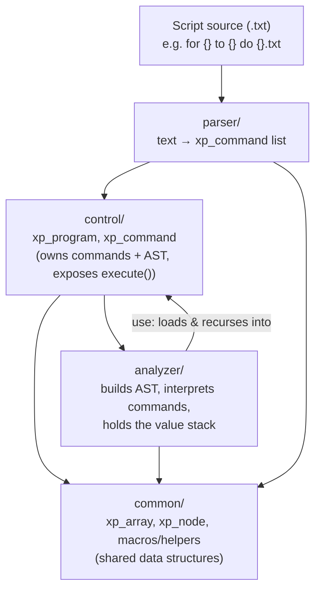

# CLAUDE.md

This file provides guidance to Claude Code (claude.ai/code) when working with code in this repository.

## What this is

A small experimental stack-based scripting language ("xp") implemented in C, along with its own interpreter (parser + analyzer/executor). Programs are semicolon-separated command lists like `push 2;push 2;push add;push print;`, operating on a single shared value stack (the "context"). Scripts can `use` (include/interpret) other `.txt` script files, including parameterized ones like `for {} to {} do {}.txt`.

## Build & run

Single-translation-unit build: `main.c` `#include`s every other `.c` file directly (parser, analyzer, control, common), so there is only one compilation unit and no separate linking step.

```
gcc -g main.c -o main.exe
./main.exe
```

The VS Code task ("Générer main.c") invokes the same mingw-w64 gcc (`x86_64-8.1.0-posix-seh-rt_v6-rev0`) and is bound as the default build task / debug preLaunchTask (F5 in VS Code builds + launches under gdb).

There is no separate test runner or test target. Tests (`tests/xp_array_test.c`, `tests/xp_parser_test.c`) are also `#include`d into `main.c` and exposed as `test_array()` / `test_parser()`. To run them, uncomment the corresponding call in `main()` in [main.c](main.c) and rebuild — only one "program" (test suite or interpreted script) runs per build/execution today, since `main()` currently runs a single hardcoded script.

## Architecture



Because everything is `#include`-concatenated into one unit by `main.c`, initialization order matters: `common` → `parser` → `control` → `analyzer` are pulled in in that order at the top of [main.c](main.c), and headers use `#pragma once` + relative includes to avoid duplicate struct definitions across the concatenation.

Pipeline for running a script: `xp_program_create` (control/xp_program.c) → `parse_multiple` (parser/xp_parser.c) splits the source on `;` and produces `xp_command` structs → `analyze` (analyzer/xp_analyzer.c) walks the command list and builds an `xp_node` tree (control-flow blocks for `if`/`for`, closed by `end`) → `program->execute()` walks the tree, dispatching each node to `xp_node_execute_default`, `xp_node_execute_if`, or `xp_node_execute_for`.

Execution state is global, not passed explicitly: `g_context` (the value stack, an `xp_array` of `any`), `g_variables`, and `g_filename` live as globals in analyzer/xp_analyzer.h and are get/set via `getContext()`. `use <file>` (see `CASE_N("use")` in xp_analyzer.c) saves/restores these globals recursively so nested script includes don't clobber the caller's state.

### Faux-OOP macro system (common/xp_utils.h)

There is no real OOP in C, so the codebase fakes vtable-style method dispatch with macros — understanding these is required to read any `.c`/`.h` pair here:

- `binding_struct(NAME) { ... }` declares a struct with function-pointer "methods" plus boilerplate (a per-type `_bind`/`_free_this` and a hidden `THIS(NAME)` global pointer used to simulate an implicit `this`).
- `binding_declare(OBJ, RET, NAME)` / `binding_declare_1` / `binding_declare_2` declare a real `OBJ_NAME(OBJ*, ...)` function plus a `_this`-suffixed wrapper that reads the hidden `THIS` pointer, used to satisfy the function-pointer signatures stored in the struct.
- `binding(NAME, METHOD)` (used inside `*_create`) wires `ret->METHOD = NAME_METHOD_this`.
- `bind(x)` sets the global `THIS(TYPE)` pointer and returns `x`, enabling call syntax like `bind(array)->push(item)` or `bind(node)->execute(node)`.
- `pack(...)` / the `pack` typedef is a poor-man's tuple (`void*[]`) used for multi-value returns, e.g. `get_variables()` returns `pack(array, string_novar)`.

Because `THIS(TYPE)` is a single global per type (not per-call, not thread-safe), nested/recursive `bind()` calls on the same type across call frames can clobber each other — be careful when adding recursive logic that binds the same struct type at multiple call depths.

### Module layout

- `common/` — `xp_utils.h` (macros above + string helpers: `trim`, `concat_str`, `cpy_str`, `read_file`, etc.), `xp_array` (manual growable array of `any`, grows in chunks of `SIZE`=10), `xp_node` (tree node with children array, parent pointer, and an `execute` delegate — used both as the AST and as the control-flow structure).
- `parser/` — turns raw script text into `xp_command` structs (`name`/`value` pairs) and extracts `{...}` placeholder variables from template strings (used by the `for {} to {} do {}.txt`-style parameterized scripts).
- `control/` — `xp_command` (name/value pair) and `xp_program` (owns the parsed commands + the root `xp_node`, exposes `execute()`).
- `analyzer/` — the actual interpreter: builds the node tree from the flat command list (`analyze`) and implements every command's runtime behavior (`xp_node_execute_default`, `_if`, `_for`, `_root`).

### Script command set (from analyzer/xp_analyzer.c)

See [COMMANDS.md](COMMANDS.md) for the full command reference and a traced example — the parser doesn't define command semantics (it just splits `name value;` pairs), so behavior is otherwise only discoverable by reading the `if/else` chain in xp_analyzer.c.

- `push <val>` — push a literal, or a special op (`print`, `add`, `equals`) that pops operands and pushes a result.
- `get <n>` / `set <n>` — read/write the stack slot at index `n` (used as makeshift variables).
- `if` / `for` / `end` — control flow; `if`/`for` open a block consuming the top of stack as condition, `end` closes the current block (see `analyze()`).
- `use <template>` — parse `{}`-placeholders out of a value (`get_variables`), load and recursively interpret another script file as a nested program, then restore outer `g_filename`/`g_variables`.
- `geta <n>` — push the `n`-th `use`-supplied variable onto the context stack.
- `pop interpret` — pop a string off the stack, parse it as a single ad-hoc command, and execute it immediately (used for self-modifying/interpreted script fragments).

Manual memory management throughout: every `*_create` has a matching `*_free`, and `xp_node_free`/`xp_program_free` free children/commands recursively — when adding new struct types, follow the same `_create`/`free` pairing and wire `free` via `binding(...)`.
